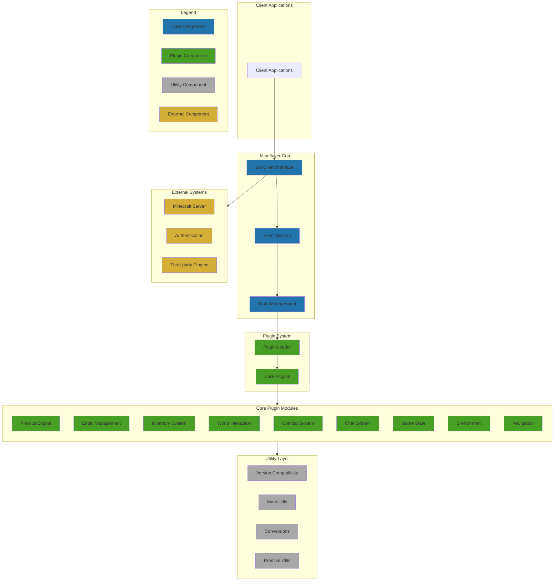

```mermaid
flowchart TB
    subgraph Client["Client Applications"]
        App[Client Applications]
    end

    subgraph Core["Mineflayer Core"]
        BotInterface["Bot Client Interface"]:::core
        EventSystem["Event System"]:::core
        StateManagement["State Management"]:::core
    end

    subgraph PluginSystem["Plugin System"]
        PluginLoader["Plugin Loader"]:::plugin
        CorePlugins["Core Plugins"]:::plugin
    end

    subgraph Plugins["Core Plugin Modules"]
        direction TB
        Physics["Physics Engine"]:::plugin
        Entities["Entity Management"]:::plugin
        Inventory["Inventory System"]:::plugin
        World["World Interaction"]:::plugin
        Combat["Combat System"]:::plugin
        Chat["Chat System"]:::plugin
        GameState["Game State"]:::plugin
        Environment["Environment"]:::plugin
        Navigation["Navigation"]:::plugin
    end

    subgraph Utils["Utility Layer"]
        Version["Version Compatibility"]:::util
        Math["Math Utils"]:::util
        Conversions["Conversions"]:::util
        PromiseUtils["Promise Utils"]:::util
    end

    subgraph External["External Systems"]
        MinecraftServer["Minecraft Server"]:::external
        Authentication["Authentication"]:::external
        ThirdPartyPlugins["Third-party Plugins"]:::external
    end

    %% Connections
    App --> BotInterface
    BotInterface --> EventSystem
    EventSystem --> StateManagement
    StateManagement --> PluginLoader
    PluginLoader --> CorePlugins
    CorePlugins --> Plugins
    Plugins --> Utils
    BotInterface --> External

    %% Click events
    click BotInterface "https://github.com/prismarinejs/mineflayer/blob/master/index.js"
    click PluginLoader "https://github.com/prismarinejs/mineflayer/blob/master/lib/plugin_loader.js"
    click CorePlugins "https://github.com/prismarinejs/mineflayer/tree/master/lib/plugins/"
    click Physics "https://github.com/prismarinejs/mineflayer/blob/master/lib/plugins/physics.js"
    click Entities "https://github.com/prismarinejs/mineflayer/blob/master/lib/plugins/entities.js"
    click Inventory "https://github.com/prismarinejs/mineflayer/blob/master/lib/plugins/inventory.js"
    click World "https://github.com/prismarinejs/mineflayer/blob/master/lib/plugins/blocks.js"
    click Combat "https://github.com/prismarinejs/mineflayer/blob/master/lib/plugins/health.js"
    click Chat "https://github.com/prismarinejs/mineflayer/blob/master/lib/plugins/chat.js"
    click GameState "https://github.com/prismarinejs/mineflayer/blob/master/lib/plugins/game.js"
    click Environment "https://github.com/prismarinejs/mineflayer/blob/master/lib/plugins/rain.js"
    click Navigation "https://github.com/prismarinejs/mineflayer/blob/master/lib/location.js"
    click Version "https://github.com/prismarinejs/mineflayer/blob/master/lib/version.js"
    click Math "https://github.com/prismarinejs/mineflayer/blob/master/lib/math.js"
    click Conversions "https://github.com/prismarinejs/mineflayer/blob/master/lib/conversions.js"
    click PromiseUtils "https://github.com/prismarinejs/mineflayer/blob/master/lib/promise_utils.js"

    %% Styles
    classDef core fill:#2374ab
    classDef plugin fill:#47a025
    classDef util fill:#a8a8a8
    classDef external fill:#d4af37

    %% Legend
    subgraph Legend
        CoreComponent["Core Component"]:::core
        PluginComponent["Plugin Component"]:::plugin
        UtilityComponent["Utility Component"]:::util
        ExternalComponent["External Component"]:::external
    end
```